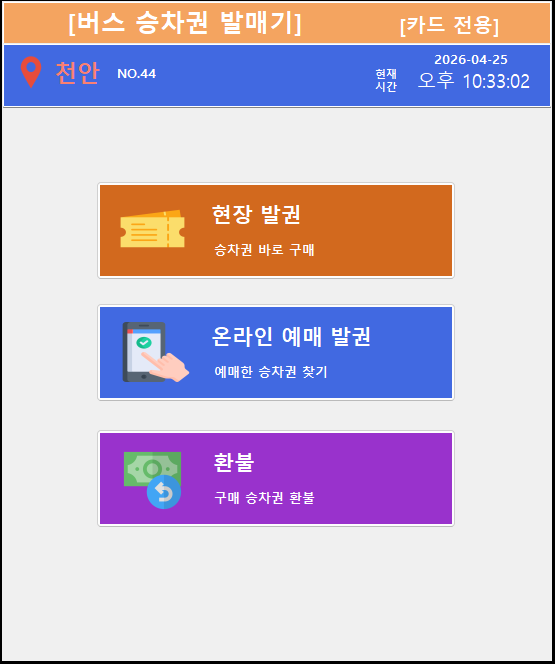
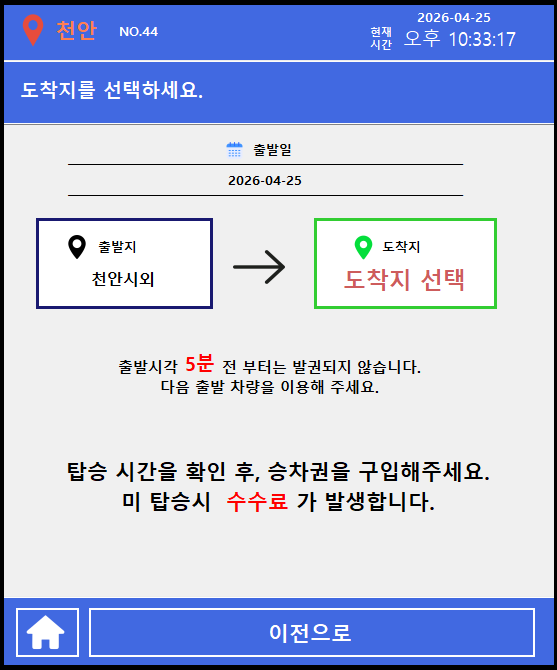
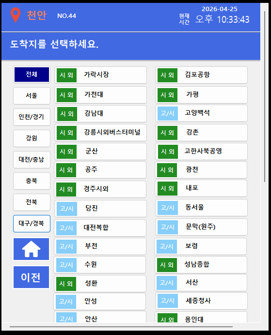
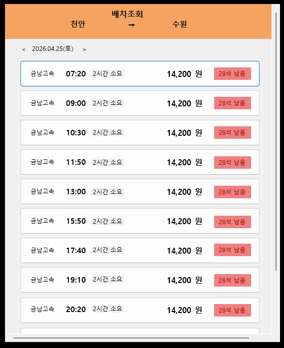
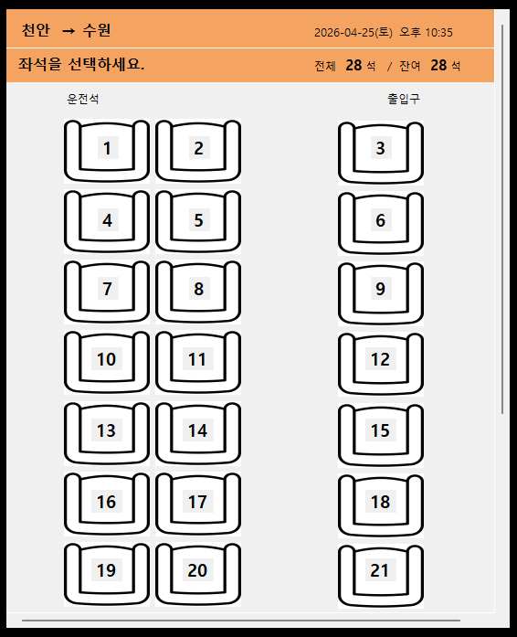
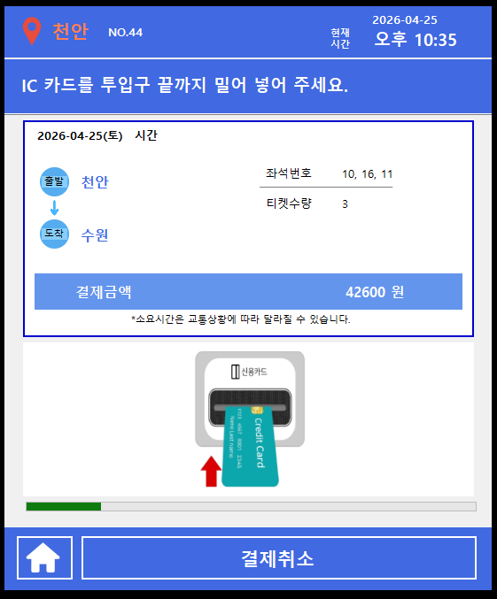
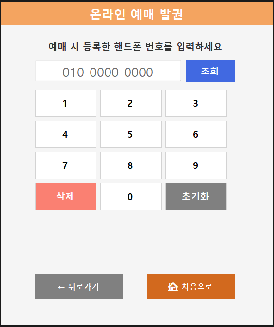
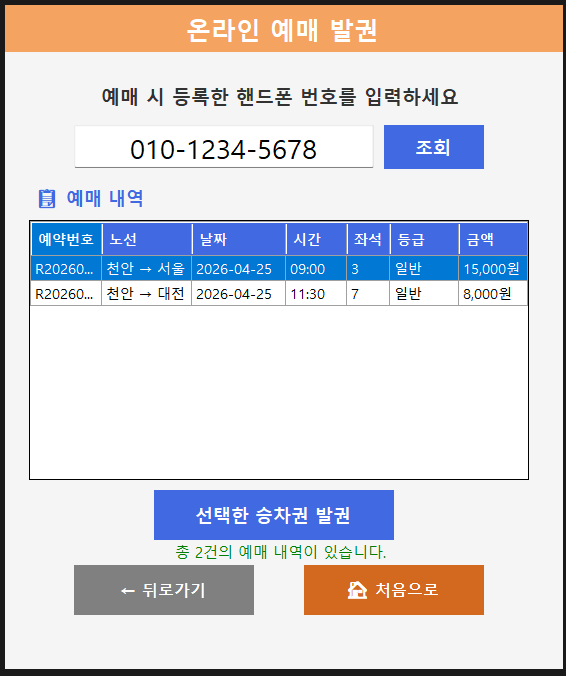
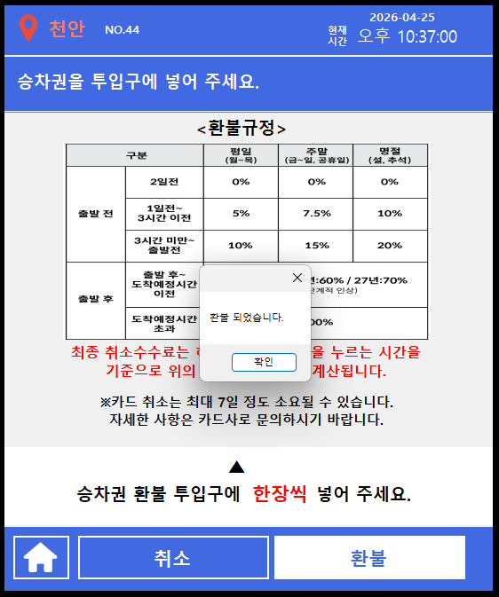
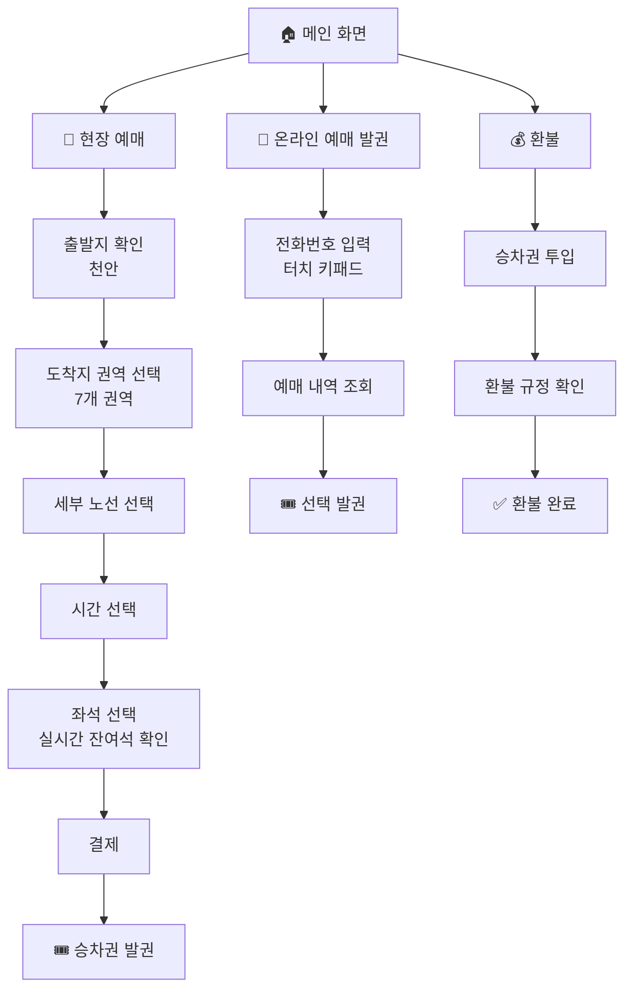

<h1 align="center">
  🚌 버스 키오스크 예매 시스템
</h1>

<p align="center">
  <strong>C# WinForms 기반 버스 승차권 키오스크 시스템</strong>
</p>

<p align="center">
  
  
  
  
</p>

<p align="center">
  현장 예매 · 온라인 예매 발권 · 환불까지 한 번에 처리하는<br/>
  무인 터미널 키오스크 솔루션
</p>

<br/>

---

<br/>

## 💡 한눈에 보기

|  | 기능 | 설명 |
|:---:|:---|:---|
| 🎫 | **현장 예매** | 권역 선택 → 노선 → 시간 → 좌석 → 결제 → 발권 |
| 📱 | **온라인 예매 발권** | 전화번호 입력으로 온라인 예매 내역 조회 및 발권 |
| 💰 | **환불** | 승차권 투입 후 시점별 수수료 자동 계산 및 환불 |
| 💺 | **실시간 좌석** | 28석 배치도에서 잔여석 한눈에 확인 |
| 🖐️ | **터치 최적화** | 키오스크 환경에 맞춘 직관적 터치 UI |
| 🗺️ | **7개 권역** | 서울·인천·강원·대전·충북·전북·대구 |

<br/>

---

<br/>

## 📌 프로젝트 개요

버스 터미널에서 사용하는 **무인 키오스크 시스템**입니다. 기존 매표 창구의 대기 시간과 인건비 문제를 해결하고, 직관적인 터치 UI를 통해 누구나 쉽게 승차권을 예매·발권·환불할 수 있습니다.

> **출발지** : 천안 고정  
> **도착지** : 서울 · 인천 · 강원 · 대전 · 충북 · 전북 · 대구 (7개 권역)

<br/>

---

<br/>

## 🎬 시연 영상

<p align="center">
  <a href="demo/busticketkiosk_demo.mp4">
    ▶️ 시연 영상 보기 (클릭하여 다운로드)
  </a>
</p>

<br/>

---

<br/>

## 📸 화면 구성

### 🎫 현장 예매 흐름

| 메인 화면 | 출발지 확인 | 노선 선택 |
|:---------:|:----------:|:---------:|
|  |  |  |

| 시간 선택 | 좌석 선택 | 결제 |
|:---------:|:---------:|:----:|
|  |  |  |

<br/>

### 📱 온라인 예매 발권

| 번호 입력 | 조회 결과 |
|:---------:|:---------:|
|  |  |

<br/>

### 💰 환불

| 환불 화면 |
|:---------:|
|  |

<br/>

---

<br/>

## 🔄 사용자 흐름도



<br/>

---

<br/>

## ⚙️ 주요 기능 상세

<table>
  <tr>
    <td width="33%" valign="top">
      <h3>🎫 현장 예매</h3>
      <p>
        <b>▸ 권역별 목적지</b> - 7개 권역에 세부노선 선택<br/>
        <b>▸ 시간 선택</b> - 출발 시간대 선택<br/>
        <b>▸ 좌석 선택</b> - 28석 배치도에서 선택/해제<br/>
        <b>▸ 결제 처리</b> - 선택 정보 확인 후 결제
      </p>
    </td>
    <td width="33%" valign="top">
      <h3>📱 온라인 발권</h3>
      <p>
        <b>▸ 터치 키패드</b> - 키오스크 최적화 숫자 입력<br/>
        <b>▸ 자동 포맷</b> - 010-0000-0000 자동 하이픈<br/>
        <b>▸ 예매 조회</b> - 전화번호 기반 내역 검색<br/>
        <b>▸ 선택 발권</b> - 원하는 예매 건 개별 발권
      </p>
    </td>
    <td width="33%" valign="top">
      <h3>💰 환불</h3>
      <p>
        <b>▸ 규정 안내</b> - 시점별 수수료 시각적 안내<br/>
        <b>▸ 승차권 투입</b> - 투입구에 승차권 삽입<br/>
        <b>▸ 환불 처리</b> - 클릭 시점 기준 수수료 자동 계산
      </p>
    </td>
  </tr>
</table>

<br/>

---

<br/>

## 🗂️ 프로젝트 구조

```
📦 Bus_Kiosk/
├── 📄 README.md
├── 📄 Kiosk.slnx
├── 📂 Kiosk/
│   ├── 📄 Program.cs                    # 앱 진입점
│   ├── 📄 Choiceservice.cs              # 메인 화면
│   │
│   ├── 🎫 현장 예매
│   │   ├── Destination.cs               # 출발지 확인
│   │   ├── DesnationChoice.cs           # 도착지 권역 선택
│   │   ├── ChoiceSeoul.cs               # 서울 방면 노선
│   │   ├── ChoiceIncheon.cs             # 인천 방면 노선
│   │   ├── ChoiceGangwon.cs             # 강원 방면 노선
│   │   ├── ChoiceDajeon.cs              # 대전 방면 노선
│   │   ├── ChoiceChungbuk.cs            # 충북 방면 노선
│   │   ├── ChoiceJeonbuk.cs             # 전북 방면 노선
│   │   ├── ChoiceDaegu.cs               # 대구 방면 노선
│   │   ├── Seat.cs                      # 좌석 선택 (28석)
│   │   ├── Time.cs                      # 시간 선택
│   │   └── Payment.cs                   # 결제 화면
│   │
│   ├── 📱 온라인 예매 발권
│   │   └── Ticket.cs                    # 번호 입력 → 조회 → 발권
│   │
│   ├── 💰 환불
│   │   └── Refund.cs                    # 환불 규정 및 처리
│   │
│   └── *.Designer.cs / *.resx           # WinForms UI 리소스
│
├── 📂 images/                           # 화면 캡처
└── 📂 demo/                             # 시연 영상
```

<br/>

---

<br/>

## 🛠️ 기술 스택

<table>
  <tr>
    <th align="center">Language</th>
    <th align="center">Framework</th>
    <th align="center">IDE</th>
    <th align="center">UI</th>
  </tr>
  <tr>
    <td align="center">
      
    </td>
    <td align="center">
      
    </td>
    <td align="center">
      
    </td>
    <td align="center">
      <br/>
      <sub>터치 최적화</sub>
    </td>
  </tr>
</table>

<br/>

---

<br/>

## 🚀 실행 방법

```bash
# 1. 저장소 클론
git clone https://github.com/your-username/Bus_Kiosk.git

# 2. Visual Studio 2022에서 Kiosk.slnx 열기

# 3. 빌드 및 실행
F5 또는 Ctrl + F5
```

> **요구 사항** : .NET 6.0 SDK 이상, Windows OS

<br/>

---

<br/>

## 📈 기대 효과

### 🏢 운영 효율성
무인 키오스크로 매표 인력을 최소화하고, 24시간 상시 운영이 가능합니다. 다수의 키오스크를 동시 운영하여 혼잡 시간대의 대기 시간을 크게 단축할 수 있습니다.

### 🙋 사용자 편의성
직관적인 터치 UI로 연령대에 관계없이 누구나 쉽게 조작할 수 있으며, 모바일 예매 후 현장에서 바로 발권하는 온라인 연동 기능을 지원합니다. 좌석 배치도에서 잔여석을 실시간으로 확인할 수 있습니다.

### 🚀 확장 가능성
현재 샘플 데이터를 실제 데이터베이스로 교체하여 운영 시스템으로 발전시킬 수 있으며, QR 코드 기반 모바일 티켓 발권, 다중 터미널 배포 등으로 확장할 수 있습니다.

<br/>

---

<br/>

## 🔮 향후 개선 사항

- [ ] 데이터베이스 연동 (MySQL / SQLite)
- [ ] 카드 결제 단말기 연동
- [ ] QR 코드 기반 모바일 발권
- [ ] 관리자 대시보드 (매출 통계, 노선 관리)
- [ ] 다국어 지원 (영어, 중국어, 일본어)
- [ ] 장애인 접근성 개선 (음성 안내, 고대비 모드)

<br/>

---

<br/>

## 📄 라이선스

이 프로젝트는 학습 목적으로 제작되었습니다.

<br/>

---

<p align="center">
  <sub>© 2025 Bus Kiosk Project · Built with ❤️</sub>
</p>
